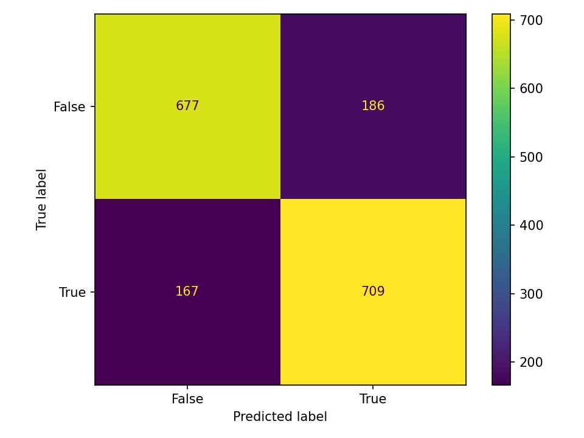
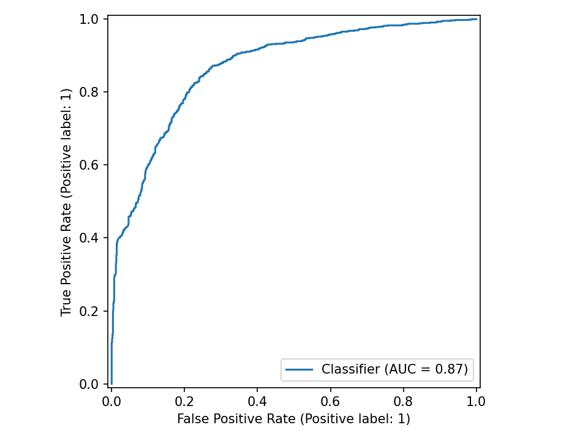
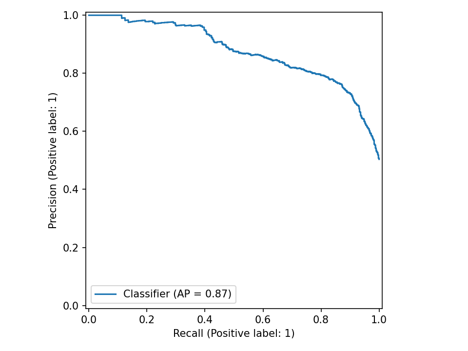

# Spaceship Titanic Classification

**Tarea:** Clasificación

## Métricas
| métrica | valor |
|---|---:|
| accuracy | 0.7970 |
| precision_macro | 0.7972 |
| recall_macro | 0.7969 |
| f1_macro | 0.7969 |
| precision_weighted | 0.7971 |
| recall_weighted | 0.7970 |
| f1_weighted | 0.7970 |
| balanced_accuracy | 0.7969 |
| mcc | 0.5941 |
| log_loss | 0.4545 |
| roc_auc | 0.8693 |
| pr_auc | 0.8746 |

## Gráficos

